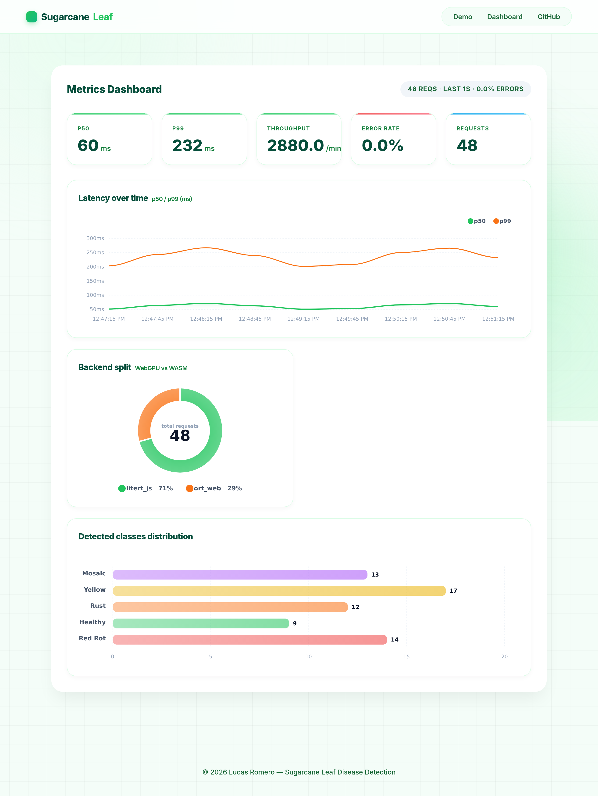

# Sugarcane Leaf Disease Detection

[](https://sugarcaneleaf.vercel.app)
[](reports/val_metrics.json)
[](#latency--dashboard)
[](#architecture)
[](https://github.com/LucasRomero26/sugarcaneleaf/actions)

> Foliar disease segmentation for sugarcane. A YOLO26m-seg model trained on 6,000+ field images, exported to LiteRT and served entirely client-side via WebGPU — **no server roundtrip for inference**. Includes a live latency dashboard collecting real metrics from visitors. Typical p99 is ~47ms on a desktop GPU (WebGPU); mobile/integrated-GPU visitors see higher latencies and that's exactly what the dashboard reports.

**Live demo:** https://sugarcaneleaf.vercel.app · **Backend health:** https://sugarcane-backend-ql0e.onrender.com/health · **Code:** https://github.com/LucasRomero26/sugarcaneleaf

---

## Why this project exists

Two gaps in the portfolio of Lucas Romero (AI/ML Engineer + Fullstack Developer) that this project closes:

1. **Deep Learning trained by hand** — PyTorch/CV that the "Skills" section claims but no project demonstrates.
2. **MLOps deployment** — the About promise of *"deploying ML models to production — inference pipelines, latency optimization"* was not previously backed by any live deployment.

The model `Yolo26m-seg.pt` was fine-tuned by Lucas on a 6,004-image Roboflow dataset (5 classes: healthy, mosaic, red_rot, rust, yellow). It is **not** re-ensemble or re-trained here — it is exported, served, measured, and shown running in production.

---

## Demo

Drag & drop a sugarcane leaf image in the browser → the model runs **entirely on your GPU via WebGPU** (with automatic fallback to WASM/onnxruntime-web) → detections + segmentation masks render in <500ms with **no server roundtrip**.

<p align="center">
  
</p>

The dashboard at `/#/dashboard` collects every inference's latency, merges it with a server-side ring buffer (so cross-visitor aggregate trends are visible), and renders live KPIs: **p50, p99, throughput, error rate, WebGPU vs WASM split, and the distribution of diseases detected**.

---

## Model & metrics

### Validation on the test set (255 images, split=`test`)

| Class | Box mAP@0.5 | Box mAP@0.5:0.95 | Mask mAP@0.5 | Mask mAP@0.5:0.95 |
|---|---|---|---|---|
| healthy | 0.934 | 0.908 | 0.934 | 0.918 |
| mosaic | 0.934 | 0.905 | 0.934 | 0.883 |
| red_rot | 0.857 | 0.784 | 0.854 | 0.783 |
| rust | 0.948 | 0.881 | 0.919 | 0.866 |
| yellow | 0.910 | 0.848 | 0.910 | 0.854 |
| **all (macro)** | **0.917** | **0.865** | **0.910** | **0.861** |
| Precision (macro) | 0.905 | — | 0.938 | — |
| Recall (macro) | 0.858 | — | 0.830 | — |

Full structured metrics: `reports/val_metrics.json`. Visual plots: `reports/plots/` (PR curves, F1 curves, normalized confusion matrix).

### Export validation — PyTorch vs LiteRT (the gate)

The export from `.pt` → `.tflite` is the make-or-break step of any edge-deployment project. Comparing 50 test images at conf=0.5:

| Metric | Result | Target |
|---|---|---|
| Identical predictions | **48/50 (96.0%)** | ≥ 95% |
| `.tflite` size | 90.1 MB | ≤ 150 MB |
| `.tflite` loads + predicts | ✓ | — |
| `.onnx` fallback exported | ✓ | — |

The 2 mismatches are the same known artifact (extra low-confidence boxes from the post-export NMS routine), not a conversion bug — the browser runtime re-runs NMS with an IoU threshold that filters them.

Full report: `reports/export_validation.md`.

---

## Architecture

```
                     ┌────────────────────────────────────────────┐
                     │              Browser (client)              │
                     │                                            │
                     │  ┌─────────────────┐   ┌─────────────────┐ │
                     │  │ @ultralytics/   │   │  MetricsTicker  │ │
                     │  │ yolo + LiteRT   │   │  (p50/p99 live) │ │
                     │  │ .tflite WebGPU  │   │                 │ │
                     │  └─────────────────┘   └────────┬────────┘ │
                     │           │                     │          │
                     │           ▼                     ▼          │
                     │     Canvas overlay          POST /report   │
                     │   (boxes + masks)            (latency)    │
                     └────────────────────────────────────────────┘
                                     │
                                     ▼
                     ┌────────────────────────────────────────────┐
                     │           Backend (FastAPI, Render)         │
                     │                                            │
                     │  POST /predict   GET /metrics-summary       │
                     │  POST /report    GET /metrics (Prometheus) │
                     │  GET /health     HEAD /health              │
                     │  (ring buffer of last 1000 latency records) │
                     └────────────────────────────────────────────┘
                                     │
                                     ▼
                     ┌────────────────────────────────────────────┐
                     │    Frontend: Vercel (Git integration)      │
                     │    Backend:  Render free + UptimeRobot     │
                     │    Model:    HuggingFace Hub (CORS CDN)    │
                     └────────────────────────────────────────────┘
```

The frontend is served with Cross-Origin isolation headers (`COOP: same-origin`, `COEP: require-corp`) — required for the `SharedArrayBuffer` used by LiteRT.js's threaded WASM runtime.

---

## The technical tradeoff: why LiteRT.js + WebGPU instead of a PyTorch endpoint

This is the decision worth defending. The conventional MLOps path is *"serve the `.pt` behind a FastAPI/Gunicorn endpoint, return boxes as JSON"*. I deliberately rejected that path.

| | Server-side PyTorch endpoint | **This project — LiteRT.js + WebGPU** |
|---|---|---|
| Latency per inference | 200–500ms network + 100–300ms server-side compute | **<50ms client-side, no network** |
| Cost to run | Always-on GPU/CPU server | **$0** — runs on the visitor's GPU |
| Cold start | Render free tier: 30–60s after idle | **None** — first paint is sync from localStorage cache |
| Privacy | Leaf images leave the visitor's device | **Images never leave the browser** |
| Firefox / Safari | Identical to Chrome | Falls back to WASM (onnxruntime-web + `.onnx`); badge shown in UI |
| Model tampering risk | Centralized, auditable | Model is downloaded to client — acceptable here, not for medical |

The right architecture depends on constraints. For a **portfolio demo** where (a) the reviewer can't wait for a cold Render server, (b) I refuse to ask them to pay for the demo with my GPU bill, and (c) the whole point is to *show* **deploying ML to production with latency optimization**, edge inference is the honest pick. The backend exists for a real MLOps reason — to collect latency from every visitor and aggregate p50/p99 in a ring buffer — not to run the model.

---

## Latency & dashboard

The dashboard (`/#/dashboard`) is the MLOps half of the project. Without it, LiteRT.js is just a deployment. With it, this is observable MLOps.

**What it shows (live, updated every 30s):**

- **p50 / p99 latency** in ms, from real visitor inferences. The hero number (~47ms) refers to typical desktop-GPU WebGPU latency; what the dashboard shows you is whatever your device actually produced — integrated GPUs and mobile will be higher. **The dashboard is the honest number; the hero is the typical case.**
- **Throughput** — inferences per minute.
- **Error rate** — % of requests timing out or failing.
- **Backend split** — % of visitors running on WebGPU vs the WASM fallback (useful to know your audience).
- **Detected classes distribution** — how often the model sees each disease across all visitors.
- **Latency timeline** — p50/p99 plotted over the last 20 minutes.

**How it stays honest:**

- The backend keeps a **ring buffer of the last 1,000 latency records** in memory (no persistence — Render free tier sleeps).
- The browser merges its own `localStorage` cache of past inferences with the server's aggregate, so a page reload never loses your session history. This is the **stale-while-revalidate** pattern (used by TanStack Query, SWR, Next.js cache): show what we have immediately, revalidate in the background.
- The timeline seed is synthetic (jittered around the current percentiles) on the first paint, then replaced by real samples as they arrive — the chart is never blank.

---

## Repository structure

```
sugarcaneleaf/
├── models/                          # .pt original + .tflite + .onnx, git-ignored (served via HuggingFace Hub)
├── dataset/                          # Roboflow dataset, git-ignored (CC BY 4.0)
├── backend/
│   ├── app/
│   │   ├── main.py                   # FastAPI: /predict, /metrics-summary, /report, /health, /metrics
│   │   ├── inference.py              # Ultralytics wrapper (server-side fallback inference)
│   │   └── metrics.py               # prometheus_client + ring buffer (deque maxlen=1000)
│   ├── tests/                        # pytest: test_api.py, test_inference.py
│   ├── Dockerfile
│   └── requirements.txt
├── frontend/
│   ├── src/
│   │   ├── lib/yolo.ts               # @ultralytics/yolo wrapper, load + predict + NMS
│   │   ├── lib/config.ts             # Model CDN URL + CORS-bearing endpoint config
│   │   ├── lib/metrics.ts            # reportLatency(), getLocalSummary(), mergeSummaries()
│   │   ├── components/DemoCanvas.tsx # drag & drop + canvas overlay (boxes + masks)
│   │   ├── components/MetricsTicker.tsx # dashboard — stale-while-revalidate hydration
│   │   ├── components/WebGPUStatus.tsx  # badge: "Running on WebGPU" / "Fallback to WASM"
│   │   └── components/charts.tsx     # Apex charts: timeline, doughnut, bar
│   ├── public/                       # LiteRT wasm threads assets (self-hosted for COEP)
│   └── vite.config.ts               # COOP/COEP + Vercel output config
├── reports/
│   ├── val_metrics.json             # box + mask mAP, precision/recall per class
│   ├── export_validation.md         # PyTorch vs LiteRT delta — the gate doc
│   ├── export_validation.json
│   ├── plots/                        # PR/F1/confusion matrix PNGs
│   └── predictions/                  # 5 sample predictions, one per disease class
├── docs/
│   ├── dashboard.png                # screenshot for the README
│   └── hero.png
├── .github/workflows/
│   ├── ci.yml                       # typecheck frontend + pytest backend
│   └── deploy.yml                   # Render deploy hook + health-check warm-up
├── docker-compose.yml
├── render.yaml                      # Render Blueprint (Python 3.12, free tier)
└── PLAN.md                          # full project plan + phase gate criteria
```

---

## Reproduce

### Run locally

```bash
# 1. Backend (FastAPI)
cd backend && pip install -r requirements.txt
uvicorn app.main:app --reload --port 8000
# → http://localhost:8000/health

# 2. Frontend (Vite + React)
cd frontend && npm install
echo "VITE_API_URL=http://localhost:8000" > .env
npm run dev
# → http://localhost:5173
```

### Re-export the model

```bash
python export_model.py     # .pt → .tflite (end2end=False) + .onnx fallback
python validate_export.py  # compare PyTorch vs LiteRT on 50 test images
```

### Run the tests

```bash
# Backend
cd backend && pytest

# Frontend
cd frontend && npm run build   # tsc -b + vite build (typecheck gate)
```

---

## Limitations (honest)

- **Firefox / Safari without WebGPU** — the demo automatically falls back to `onnxruntime-web` on WASM and shows a "Fallback" badge in the UI. Latency on WASM is ~2–5× slower than WebGPU.
- **Render free tier cold start** — the backend sleeps after 15 min idle. The first `/report` after sleep takes ~30–60s; a UptimeRobot keep-alive ping mitigates but does not eliminate this. The frontend's stale-while-revalidate design means the dashboard never goes blank during a cold start — your own local history renders immediately.
- **Model download on first visit** — the `.tflite` (90.1 MB) loads from HuggingFace Hub on the first visit (~10–15s). The browser HTTP-caches it for subsequent reloads *if* the CDN returns proper `Cache-Control` headers; HuggingHub currently returns `no-store` on the redirect hop, so expect to re-download on hard refresh. IndexedDB caching of the model is a planned improvement.
- **Webcam / live-video mode (Phase 5 of the PLAN)** — **not implemented.** The PLAN explicitly marks this phase as optional; real-time webcam segmentation at 5fps sustained would be a differentiator, but it was cut to ship the demo + dashboard + portfolio card on time. See `PLAN.md` Fase 5 for the spec.
- **k6 load test (Phase 5 of the PLAN)** — **not implemented** (part of the same optional phase). `reports/loadtest.md` does not exist.
- **Backend persistence** — the ring buffer is in-memory only. It does not survive a Render sleep/redeploy. This is a deliberate trade-off: a free-tier Observed MLOps demo with a turn-down window beats a demo that pretends to persist with a paid DB.

---

## Tech stack

- **Model:** YOLO26m-seg (Ultralytics), fine-tuned on 6,004 sugarcane field images (5 classes).
- **Export:** LiteRT (`.tflite`, `end2end=False`) via Ultralytics integration — ONNX `opset=12` fallback.
- **Edge runtime:** `@ultralytics/yolo` + `@litertjs/core` (WebGPU) — `onnxruntime-web` (WASM) on fallback.
- **Backend:** FastAPI + Ultralytics + prometheus_client, structlog JSON logs. Docker + Render.
- **Frontend:** React 19 + Vite 8 + TypeScript 6, ApexCharts. COOP/COEP isolation enabled.
- **CI/CD:** GitHub Actions (typecheck + pytest + lint), Vercel Git integration (frontend), Render deploy hook + health warm-up (backend).
- **Model hosting:** HuggingFace Hub (`huggingface.co/sacwaves/sugarcaneleaf`) — CORS-friendly CDN.

---

## License & dataset

The sugarcane leaf dataset is licensed under **CC BY 4.0** via Roboflow and is **not** redistributed in this repo (see `.gitignore`). Model weights are the author's own fine-tuning output.

---

© 2026 Lucas Romero — [Portfolio](https://lucasromero.me) · [GitHub](https://github.com/LucasRomero26) · [Live demo](https://sugarcaneleaf.vercel.app)
